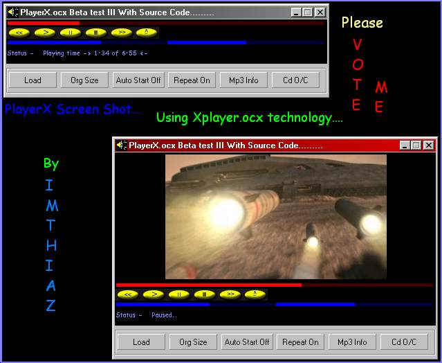

<div align="center">

## Xplayer\.Ocx Beta test II With Complete Source Code Which Replace MediaPlayer\.Ocx\(New Playlist Added\)


</div>

### Description

Xplayer Control was mainly done to replace mediaplayer.ocx. This does almost all the work done by the mediaplayer[ Ihope so]. This control supports the following file formats Dat, Avi, Mp3, Wav, Mpg & Wma files. It has fullscreen mode in which shortcut keys Like Play,Pause,Skip & volume Control. This control Can read mp3 files tag. It can open and close Cd tray. You can change almost all the color in the control. All the controls can hide or unhide. You can access almost all the functions of control thru your coding. The only bug in this control is when user plays a uncompressed movie file in fullscreen mode. the Program and system hangs. I hope the Bright peoples of planetsourcecode.com will correct that bug. The code is little shabby and not commented. I think so you will understand since the code is simple. It took a lot of time for me do this project. Sorry for the late release of source code. Please Vote for me. Please..........Vote my program..........

Now Playlist Added to it..

Vote me
 
### More Info
 


<span>             |<span>
---                |---
**Submitted On**   |2000-10-04 22:00:40
**By**             |[Imthiaz Rafiq](https://github.com/Planet-Source-Code/PSCIndex/blob/master/ByAuthor/imthiaz-rafiq.md)
**Level**          |Intermediate
**User Rating**    |4.6 (281 globes from 61 users)
**Compatibility**  |VB 6\.0
**Category**       |[Sound/MP3](https://github.com/Planet-Source-Code/PSCIndex/blob/master/ByCategory/sound-mp3__1-45.md)
**World**          |[Visual Basic](https://github.com/Planet-Source-Code/PSCIndex/blob/master/ByWorld/visual-basic.md)
**Archive File**   |[CODE\_UPLOAD104221042000\.zip](https://github.com/Planet-Source-Code/imthiaz-rafiq-xplayer-ocx-beta-test-ii-with-complete-source-code-which-replace-mediaplayer__1-11874/archive/master.zip)

### API Declarations

```
Too Many..
Please Vote Me
```


